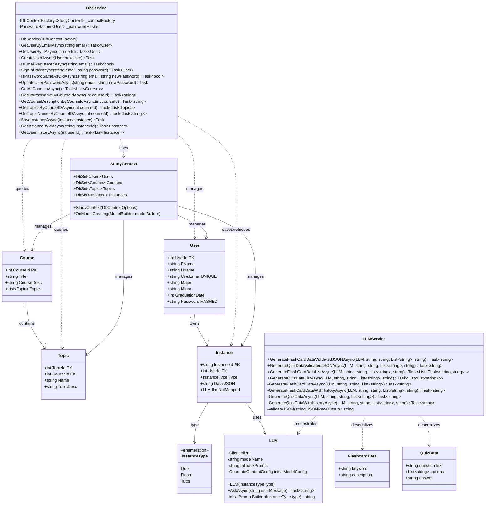
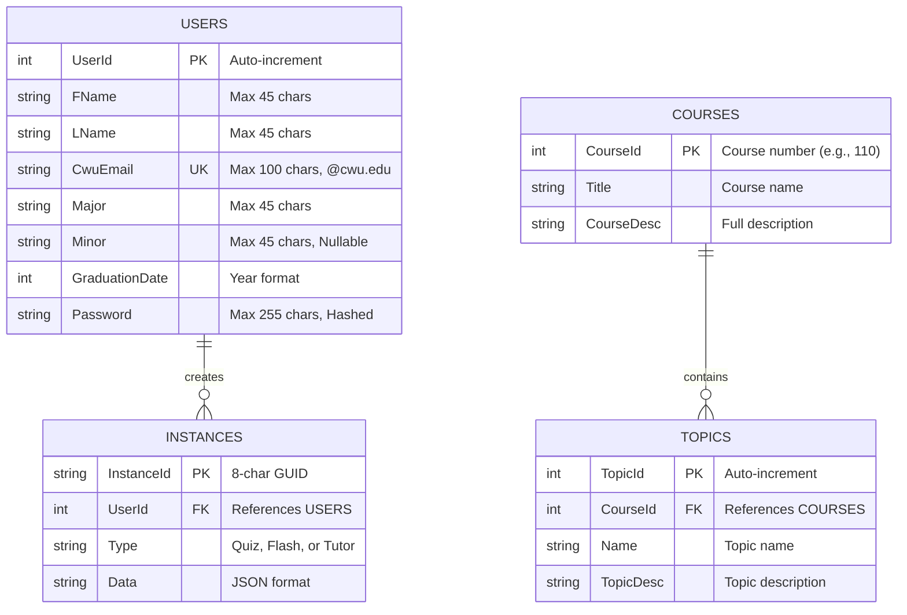
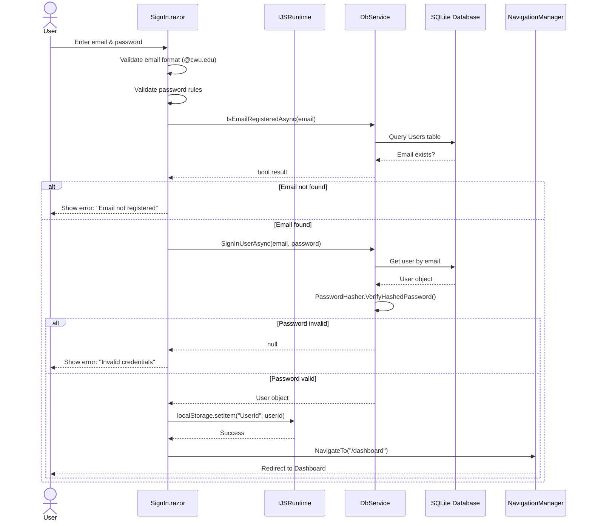
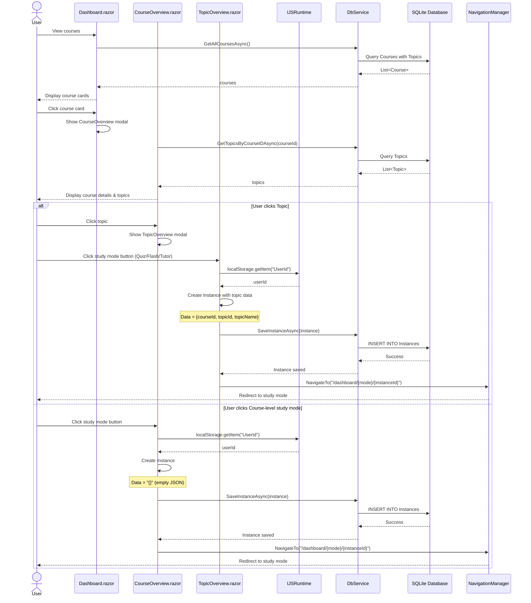
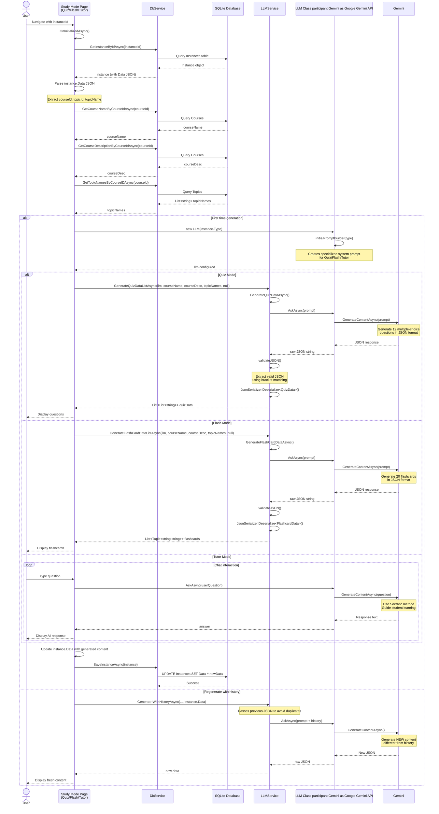
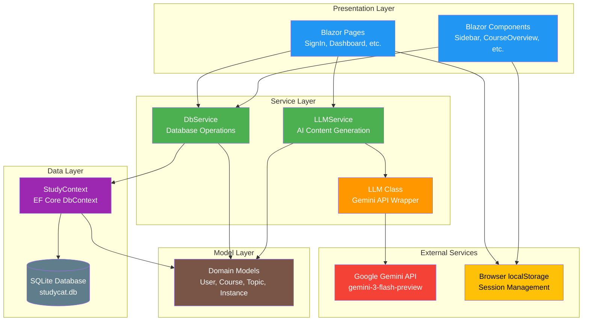

## Graphs and Charts

## Table of Figures
1. [Complete Class Diagram](#complete-class-diagram)
2. [Blazor Component Hierarchy](#blazor-component-hierarchy)
3. [Database Schema](#database-schema)
4. [Authentication Flow](#authentication-flow)
5. [Instance Creation Flow](#instance-creation-flow)
6. [LLM Integration Flow](#llm-integration-flow)
7. [Service Layer Architecture](#service-layer-architecture)

---

## Complete Class Diagram

---

## Blazor Component Hierarchy

```mermaid
graph TD 
App["App.razor<br/>Root Component"] 
App --> Routes["Routes"] 
Routes --> SignIn["SignIn.razor<br/>Route: /"] 
Routes --> CreateAccount["CreateAccount.razor<br/>Route: /create-account"] 
Routes --> ChangePassword["ChangePassword.razor<br/>Route: /change-password"] 
Routes --> Dashboard["Dashboard.razor<br/>Route: /dashboard"] 
Routes --> QuizMode["QuizMode.razor<br/>Route: /dashboard/quiz/:id"] 
Routes --> FlashMode["FlashMode.razor<br/>Route: /dashboard/flash/:id"] 
Routes --> TutorMode["TutorMode.razor<br/>Route: /dashboard/tutor/:id"]

%% Dashboard Components
Dashboard --> Sidebar1["Sidebar Component"]
Dashboard --> CourseOverview["CourseOverview Modal"]

CourseOverview --> TopicOverview["TopicOverview Modal"]

%% Study Mode Components
QuizMode --> Sidebar2["Sidebar Component"]
FlashMode --> Sidebar3["Sidebar Component"]
TutorMode --> Sidebar4["Sidebar Component"]

%% Injected Services
SignIn -.->|injects| DbSvc1["DbService"]
SignIn -.->|injects| NavMgr1["NavigationManager"]
SignIn -.->|injects| JS1["IJSRuntime"]

CreateAccount -.->|injects| DbSvc2["DbService"]
CreateAccount -.->|injects| NavMgr2["NavigationManager"]

ChangePassword -.->|injects| DbSvc3["DbService"]
ChangePassword -.->|injects| NavMgr3["NavigationManager"]

Dashboard -.->|injects| DbSvc4["DbService"]
Dashboard -.->|injects| NavMgr4["NavigationManager"]
Dashboard -.->|injects| JS2["IJSRuntime"]

CourseOverview -.->|injects| DbSvc5["DbService"]
CourseOverview -.->|injects| NavMgr5["NavigationManager"]
CourseOverview -.->|injects| JS3["IJSRuntime"]

TopicOverview -.->|injects| DbSvc6["DbService"]
TopicOverview -.->|injects| NavMgr6["NavigationManager"]
TopicOverview -.->|injects| JS4["IJSRuntime"]

Sidebar1 -.->|injects| DbSvc7["DbService"]
Sidebar1 -.->|injects| NavMgr7["NavigationManager"]
Sidebar1 -.->|injects| JS5["IJSRuntime"]

style App fill:#2196F3,color:#fff
style Dashboard fill:#4CAF50,color:#fff
style QuizMode fill:#FF9800,color:#fff
style FlashMode fill:#FF9800,color:#fff
style TutorMode fill:#FF9800,color:#fff
style CourseOverview fill:#9C27B0,color:#fff
style TopicOverview fill:#9C27B0,color:#fff
style Sidebar1 fill:#607D8B,color:#fff
```

---

## Database Schema

---

## Authentication Flow

---

## Instance Creation Flow

---

## LLM Integration Flow

---

## Service Layer Architecture
