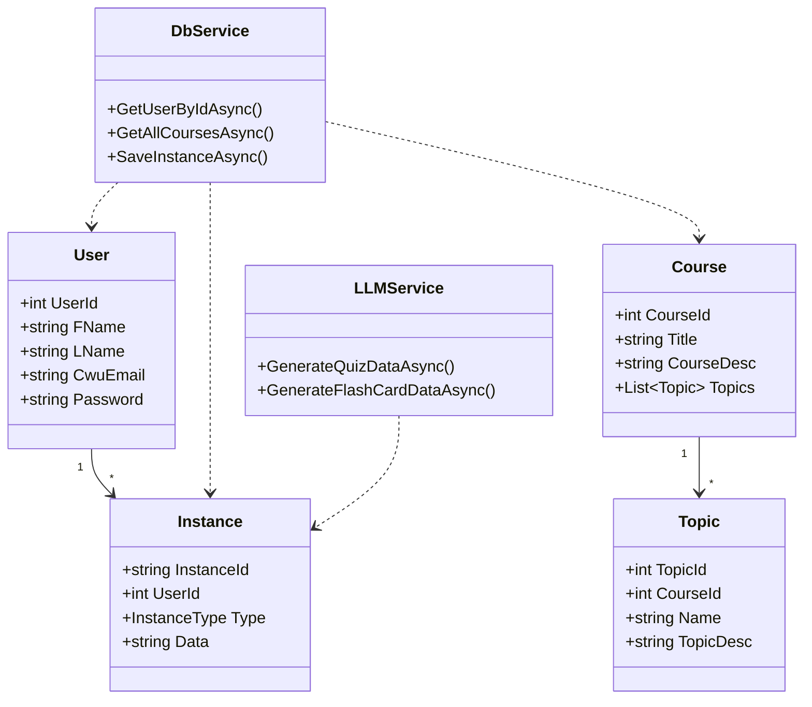
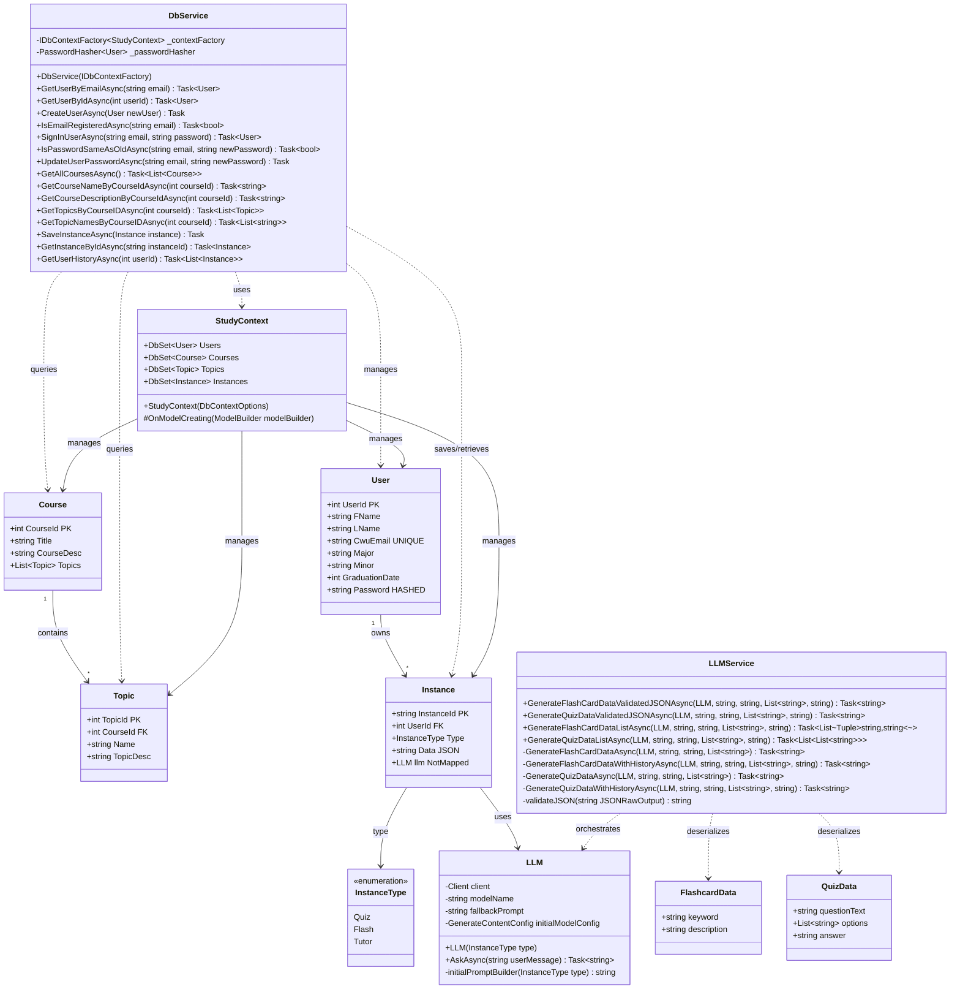
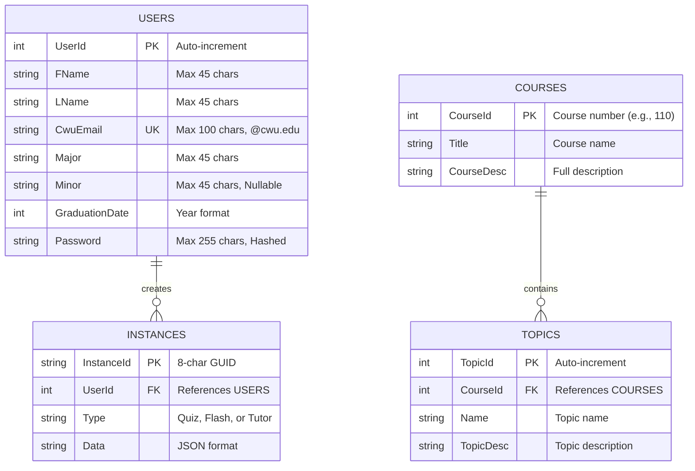
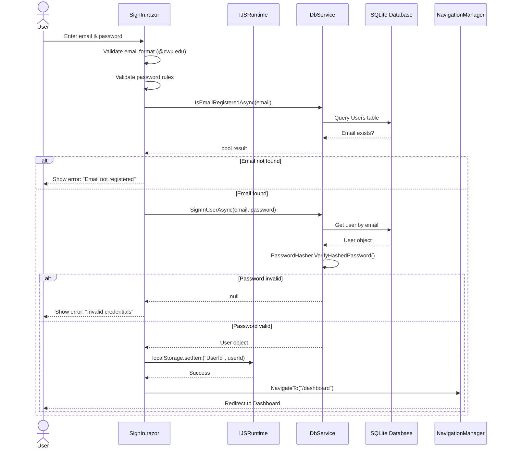
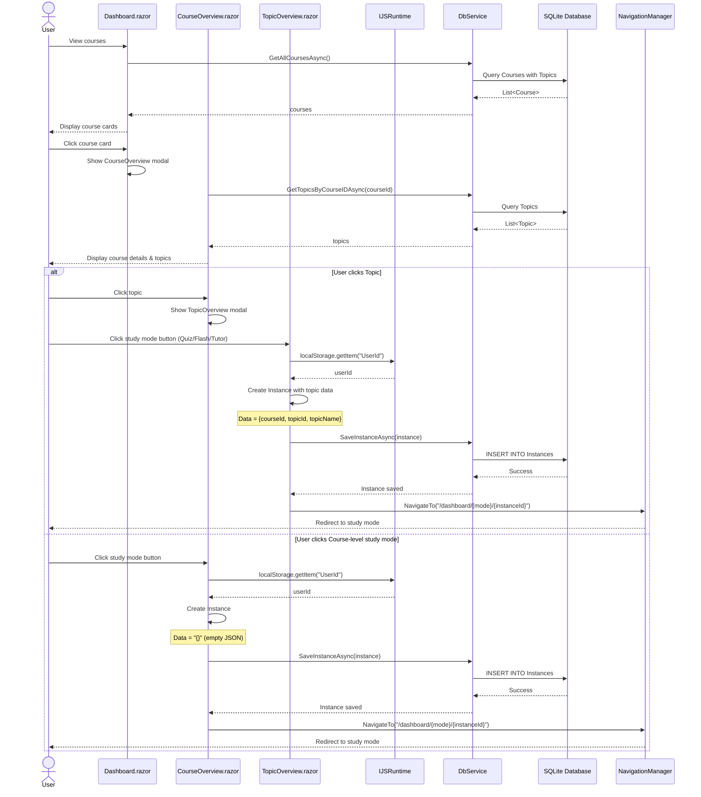
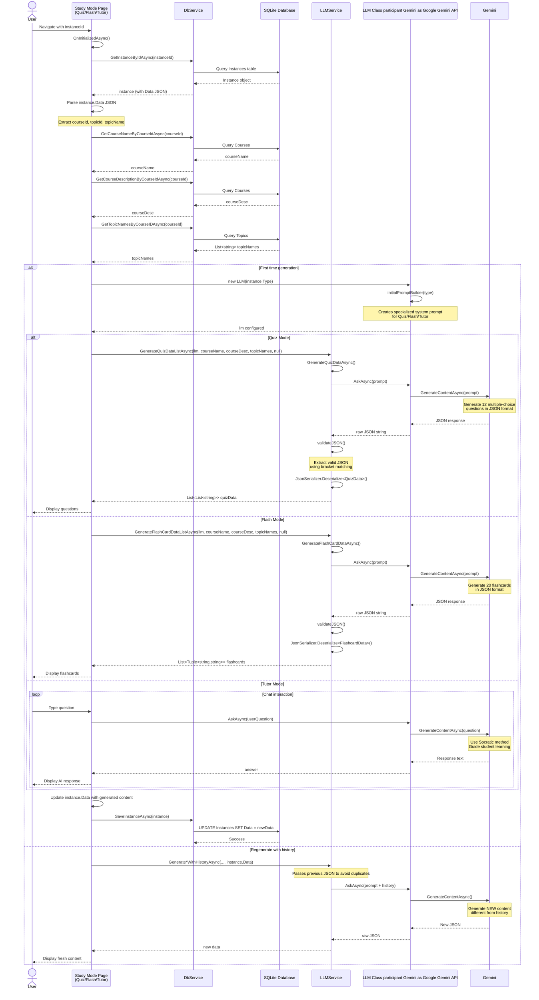
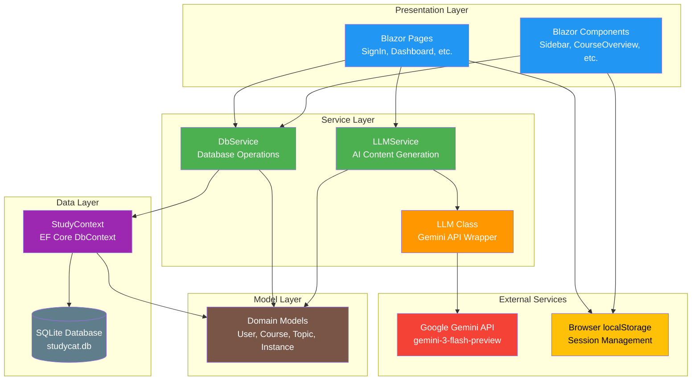

# CSLLMCapstone

# CS Study Cat - Technical Documentation

## Table of Contents

1. [Project Overview](#project-overview)
2. [Architecture](#architecture)
3. [Model Classes](#model-classes)
   - [User](#user)
   - [Course](#course)
   - [Topic](#topic)
   - [Instance](#instance)
   - [InstanceType](#instancetype-enum)
   - [LLM](#llm)
4. [Service Classes](#service-classes)
   - [DbService](#dbservice)
   - [LLMService](#llmservice)
   - [FlashcardData](#flashcarddata)
   - [QuizData](#quizdata)
5. [Data Context](#data-context)
   - [StudyContext](#studycontext)
6. [Blazor Components](#blazor-components)
   - [Pages](#pages)
     - [SignIn](#signin)
     - [CreateAccount](#createaccount)
     - [ChangePassword](#changepassword)
     - [Dashboard](#dashboard)
     - [QuizMode](#quizmode)
     - [FlashMode](#flashmode)
     - [TutorMode](#tutormode)
   - [Layout Components](#layout-components)
     - [Sidebar](#sidebar)
     - [CourseOverview](#courseoverview)
     - [TopicOverview](#topicoverview)
7. [Database Migrations](#database-migrations)
8. [Dependencies](#dependencies)
9. [Graphs and Charts](#graphs-and-charts)

---

## Project Overview

**CS Study Cat** is a Blazor Server application targeting .NET 10 that provides an AI-powered study platform for Computer Science students at Central Washington University. The application offers three study modes:
- **Quiz Mode**: Test knowledge with AI-generated multiple-choice questions
- **Flashcard Mode**: Learn terms and concepts with AI-generated flashcards
- **Tutor Mode**: Interactive AI tutoring using the Socratic method

The application uses:
- **Entity Framework Core** with SQLite for data persistence
- **Google Gemini API** for AI content generation
- **ASP.NET Core Identity** for password hashing
- **Blazor Server** for interactive UI

---

## Architecture

The application follows a layered architecture:
- **Presentation Layer**: Blazor Razor components
- **Service Layer**: Business logic in `DbService` and `LLMService`
- **Data Layer**: Entity Framework Core with `StudyContext`
- **Model Layer**: Domain entities and enums
  
---

## Model Classes

### User

**Location**: `CSLLMCapstone\Models\User.cs`

Represents a registered user in the system.

#### Properties

| Property | Type | Description | Constraints |
|----------|------|-------------|-------------|
| `UserId` | `int` | Primary key, auto-generated | `[Key]` |
| `FName` | `string` | First name | `[Required]`, `[MaxLength(45)]` |
| `LName` | `string` | Last name | `[Required]`, `[MaxLength(45)]` |
| `CwuEmail` | `string` | CWU email address (unique) | `[Required]`, `[MaxLength(100)]`, must end with `@cwu.edu` |
| `Major` | `string` | Student's major | `[Required]`, `[MaxLength(45)]` |
| `Minor` | `string?` | Student's minor (optional) | `[MaxLength(45)]`, nullable |
| `GraduationDate` | `int` | Expected graduation year | Stored as integer (e.g., 2026) |
| `Password` | `string` | Hashed password | `[Required]`, `[MaxLength(255)]` |

#### Notes
- Passwords are hashed using `PasswordHasher<User>` from ASP.NET Core Identity
- Email uniqueness is enforced at the database level via index

---

### Course

**Location**: `CSLLMCapstone\Models\Course.cs`

Represents a Computer Science course.

#### Properties

| Property | Type | Description | Constraints |
|----------|------|-------------|-------------|
| `CourseId` | `int` | Course number (e.g., 110, 301) | `[Key]` |
| `Title` | `string` | Course title | `[Required]` |
| `CourseDesc` | `string` | Detailed course description | `[Required]` |
| `Topics` | `List<Topic>` | Navigation property to related topics | Initialized as empty list |

#### Notes
- Course data is seeded during database initialization
- Includes 32 CS courses from CWU's curriculum (CS 102 through CS 489)

---

### Topic

**Location**: `CSLLMCapstone\Models\Topic.cs`

Represents a specific topic within a course.

#### Properties

| Property | Type | Description | Constraints |
|----------|------|-------------|-------------|
| `TopicId` | `int` | Primary key, auto-generated | `[Key]` |
| `CourseId` | `int` | Foreign key to Course | `[ForeignKey("Course")]` |
| `Name` | `string` | Topic name | `[Required]` |
| `TopicDesc` | `string` | Topic description | `[Required]` |

#### Notes
- 468 topics are seeded across all courses
- Topics are used to generate targeted study materials

---

### Instance

**Location**: `CSLLMCapstone\Models\Instance.cs`

Represents a study session (Quiz, Flashcard, or Tutor).

#### Properties

| Property | Type | Description | Constraints |
|----------|------|-------------|-------------|
| `InstanceId` | `string` | Unique 8-character identifier | `[Key]`, `[MaxLength(8)]`, auto-generated GUID substring |
| `UserId` | `int` | Foreign key to User | `[ForeignKey("User")]` |
| `User` | `User?` | Navigation property to User | Nullable |
| `Type` | `InstanceType` | Type of study session | `[Required]` enum value |
| `Data` | `string` | JSON-formatted session data | `[Required]`, defaults to `"{}"` |
| `llm` | `LLM?` | Associated LLM instance | `[NotMapped]`, not persisted |

#### Notes
- `Data` field stores course ID, topic ID, and generated content in JSON format
- `llm` property is transient and used for in-memory AI interactions

---

### InstanceType (Enum)

**Location**: `CSLLMCapstone\Models\Instance.cs`

Defines the types of study sessions available.

#### Values

| Value | Description |
|-------|-------------|
| `Quiz` | Multiple-choice quiz mode |
| `Flash` | Flashcard study mode |
| `Tutor` | Interactive AI tutor mode |

---

### LLM

**Location**: `CSLLMCapstone\Models\LLM.cs`

Wrapper class for interacting with the Google Gemini API.

#### Fields

| Field | Type | Description |
|-------|------|-------------|
| `client` | `Client` | Google GenAI client instance |
| `modelName` | `string` | Model identifier ("gemini-3-flash-preview") |
| `fallbackPrompt` | `string` | Default system prompt |
| `initialModelConfig` | `GenerateContentConfig` | Configuration with system instruction |

#### Constructor
public LLM(InstanceType type)

**Parameters:**
- `type`: The type of instance (Quiz, Flash, or Tutor) which determines the system prompt

**Description:**
- Initializes the Google GenAI client
- Builds appropriate system prompt based on instance type
- Configures the model with system instructions

**Dependencies:**
- `Google.GenAI` library
- `initialPromptBuilder()` private method

#### Methods

##### `AskAsync(string userMessage)`

**Returns:** `Task<string>` - AI-generated response

**Parameters:**
- `userMessage`: User's query or prompt

**Description:**
- Sends the user message to Gemini API
- Returns the generated text from the first candidate response

**Dependencies:**
- `client.Models.GenerateContentAsync()` from Google GenAI SDK

##### `initialPromptBuilder(InstanceType type)` (Private)

**Returns:** `string` - System prompt for the LLM

**Parameters:**
- `type`: Instance type to determine prompt

**Description:**
- Creates specialized system prompts for each mode:
  - **Quiz**: Generates 12 multiple-choice questions in JSON format
  - **Tutor**: Uses Socratic method, refuses off-topic questions
  - **Flash**: Generates 20 flashcards in JSON format
  
**Example Output (Quiz):**
{ "question 1": { "question text": "What is polymorphism?", "options": ["A", "B", "C", "D"], "answer": "B" } }

---

## Service Classes

### DbService

**Location**: `CSLLMCapstone\Services\DbService.cs`

Handles all database interactions using Entity Framework Core with a factory pattern for thread safety.

#### Fields

| Field | Type | Description |
|-------|------|-------------|
| `_contextFactory` | `IDbContextFactory<StudyContext>` | Context factory for creating DB contexts |
| `_passwordHasher` | `PasswordHasher<User>` | Password hasher instance |

#### Constructor
public DbService(IDbContextFactory<StudyContext> contextFactory, PasswordHasher<User> passwordHasher)

**Parameters:**
- `contextFactory`: Factory for creating `StudyContext` instances
- `passwordHasher`: Password hasher for user registration and management

**Description:**
- Initializes the DbService with provided context factory and password hasher
- Context factory is used to create database contexts for interactions
- Password hasher is used to hash and verify user passwords

**Dependencies:**
- `Microsoft.EntityFrameworkCore`
- `initializes the _contextFactory and _passwordHasher fields`

public DbService(IDbContextFactory<StudyContext> contextFactory)

**Description:** Initializes the service with dependency injection of the context factory

#### User Methods

##### `GetUserByEmailAsync(string email)`

**Returns:** `Task<User?>` - User object or null

**Dependencies:**
- Entity Framework Core `FirstOrDefaultAsync()`
- LINQ query filtering

**Description:** Retrieves user by email address

##### `GetUserByIdAsync(int userId)`

**Returns:** `Task<User?>` - User object or null

**Dependencies:**
- Entity Framework Core `FirstOrDefaultAsync()`

**Description:** Retrieves user by ID (used for session management)

##### `CreateUserAsync(User newUser)`

**Returns:** `Task`

**Dependencies:**
- `PasswordHasher<User>.HashPassword()`
- Entity Framework Core `Add()` and `SaveChangesAsync()`

**Description:**
- Hashes the plain-text password before storage
- Adds new user to database
- Throws exception if email is already registered

##### `IsEmailRegisteredAsync(string email)`

**Returns:** `Task<bool>` - True if email exists

**Dependencies:**
- Entity Framework Core `AnyAsync()`

**Description:** Checks if email is already registered

##### `SignInUserAsync(string email, string password)`

**Returns:** `Task<User?>` - User if successful, null otherwise

**Dependencies:**
- `PasswordHasher<User>.VerifyHashedPassword()`
- `GetUserByEmailAsync()` method

**Description:**
1. Retrieves user by email
2. Verifies plain-text password against stored hash
3. Returns user on success, null on failure

##### `IsPasswordSameAsOldAsync(string email, string newPassword)`

**Returns:** `Task<bool>` - True if passwords match

**Dependencies:**
- `PasswordHasher<User>.VerifyHashedPassword()`
- Entity Framework Core queries

**Description:** Used during password reset to prevent reusing old passwords

##### `UpdateUserPasswordAsync(string email, string newPassword)`

**Returns:** `Task`

**Dependencies:**
- `PasswordHasher<User>.HashPassword()`
- Entity Framework Core `SaveChangesAsync()`

**Description:**
- Hashes new password
- Updates user record in database

#### Course Methods

##### `GetAllCoursesAsync()`

**Returns:** `Task<List<Course>>` - List of all courses with topics

**Dependencies:**
- Entity Framework Core `Include()` and `ToListAsync()`

**Description:** Eager loads courses with their associated topics

##### `GetCourseNameByCourseIdAsync(int courseId)`

**Returns:** `Task<string?>` - Course title or null

**Dependencies:**
- LINQ `Where()` and `Select()`
- Entity Framework Core `FirstOrDefaultAsync()`

**Description:** Retrieves only the course title by ID

##### `GetCourseDescriptionByCourseIdAsync(int courseId)`

**Returns:** `Task<string?>` - Course description or null

**Dependencies:**
- LINQ `Where()` and `Select()`
- Entity Framework Core `FirstOrDefaultAsync()`

**Description:** Retrieves only the course description by ID

#### Topic Methods

##### `GetTopicsByCourseIDAsync(int courseId)`

**Returns:** `Task<List<Topic>>` - List of topics for the course

**Dependencies:**
- LINQ `Where()`
- Entity Framework Core `ToListAsync()`

**Description:** Retrieves all topics associated with a course

##### `GetTopicNamesByCourseIDAsnyc(int courseId)`

**Returns:** `Task<List<string>>` - List of topic names

**Dependencies:**
- LINQ `Where()` and `Select()`
- Entity Framework Core `ToListAsync()`

**Description:** Retrieves only topic names (used for LLM prompts)

#### Instance Methods

##### `SaveInstanceAsync(Instance instance)`

**Returns:** `Task`

**Dependencies:**
- Entity Framework Core `Add()` and `SaveChangesAsync()`

**Description:** Persists a new study session instance

##### `GetInstanceByIdAsync(string instanceId)`

**Returns:** `Task<Instance?>` - Instance with user data or null

**Dependencies:**
- Entity Framework Core `Include()` and `FirstOrDefaultAsync()`

**Description:** Retrieves instance with eager-loaded user data

##### `GetUserHistoryAsync(int userId)`

**Returns:** `Task<List<Instance>>` - Ordered list of user's instances

**Dependencies:**
- LINQ `Where()` and `OrderByDescending()`
- Entity Framework Core `ToListAsync()`

**Description:** Gets user's study history, newest first

---

### LLMService

**Location**: `CSLLMCapstone\Services\LLMService.cs`

Manages AI content generation and JSON validation.

#### Public Methods

##### `GenerateFlashCardDataValidatedJSONAsync(LLM llm, string courseName, string courseDesc, List<string> courseTopics, string? history)`

**Returns:** `Task<string>` - Validated JSON string

**Parameters:**
- `llm`: Configured LLM instance
- `courseName`: Name of the course
- `courseDesc`: Course description
- `courseTopics`: List of topic names
- `history`: Previous JSON data (null for first generation)

**Dependencies:**
- `GenerateFlashCardDataAsync()` or `GenerateFlashCardDataWithHistoryAsync()`
- `validateJSON()` private method

**Description:**
- Generates flashcard JSON with or without history
- Validates and cleans the JSON output

##### `GenerateQuizDataValidatedJSONAsync(LLM llm, string courseName, string courseDesc, List<string> courseTopics, string? history)`

**Returns:** `Task<string>` - Validated JSON string

**Dependencies:**
- `GenerateQuizDataAsync()` or `GenerateQuizDataWithHistoryAsync()`
- `validateJSON()` private method

**Description:** Similar to flashcard generation but for quiz data

##### `GenerateFlashCardDataListAsync(LLM llm, string courseName, string courseDesc, List<string> courseTopics, string? history)`

**Returns:** `Task<List<Tuple<string, string>>>` - List of (keyword, description) tuples

**Dependencies:**
- `GenerateFlashCardDataValidatedJSONAsync()`
- `System.Text.Json.JsonSerializer.Deserialize()'

**Description:**
1. Generates validated JSON
2. Deserializes into `Dictionary<string, FlashcardData>`
3. Converts to list of tuples
4. Uses case-insensitive JSON deserialization

##### `GenerateQuizDataListAsync(LLM llm, string courseName, string courseDesc, List<string> courseTopics, string? history)`

**Returns:** `Task<List<List<string>>>` - List of quiz questions (each containing question, options, answer)

**Dependencies:**
- `GenerateQuizDataValidatedJSONAsync()`
- `System.Text.Json.JsonSerializer.Deserialize()'

**Description:**
1. Generates validated JSON
2. Deserializes into `Dictionary<string, QuizData>`
3. Converts to nested list format: `[questionText, option1, option2, option3, option4, answer]`

#### Private Methods

##### `GenerateFlashCardDataAsync(LLM llm, string courseName, string courseDesc, List<string> courseTopics)`

**Returns:** `Task<string>` - Raw JSON from LLM

**Dependencies:**
- `string.Join()` to concatenate topics
- `LLM.AskAsync()`

**Description:** Generates flashcards without considering previous content

##### `GenerateFlashCardDataWithHistoryAsync(LLM llm, string courseName, string courseDesc, List<string> courseTopics, string history)`

**Returns:** `Task<string>` - Raw JSON from LLM

**Dependencies:**
- `string.Join()` to concatenate topics
- `LLM.AskAsync()`

**Description:** Generates flashcards while avoiding duplicates from history

##### `GenerateQuizDataAsync(LLM llm, string courseName, string courseDesc, List<string> courseTopics)`

**Returns:** `Task<string>` - Raw JSON from LLM

**Dependencies:**
- `LLM.AskAsync()`

**Description:** Generates quiz questions without history

##### `GenerateQuizDataWithHistoryAsync(LLM llm, string courseName, string courseDesc, List<string> courseTopics, string history)`

**Returns:** `Task<string>` - Raw JSON from LLM

**Dependencies:**
- `LLM.AskAsync()`

**Description:** Generates quiz questions while avoiding duplicates

##### `validateJSON(string JSONRawOutput)` (Private)

**Returns:** `string` - Clean JSON string

**Dependencies:**
- `Stack<char>` for bracket matching

**Description:**
- Extracts valid JSON from LLM output that may contain extra text
- Uses stack-based bracket matching algorithm
- Finds first `{` and last matching `}`
- Strips markdown code fences and explanatory text

**Algorithm:**
1. Iterate through characters
2. Push opening brackets onto stack
3. Pop on closing brackets
4. Extract content when stack is empty (matching brackets found)

---

### FlashcardData

**Location**: `CSLLMCapstone\Services\LLMService.cs`

Helper class for deserializing flashcard JSON.

#### Properties

| Property | Type | Description |
|----------|------|-------------|
| `keyword` | `string` | Flashcard term/keyword |
| `description` | `string` | Explanation/definition |

---

### QuizData

**Location**: `CSLLMCapstone\Services\LLMService.cs`

Helper class for deserializing quiz JSON.

#### Properties

| Property | Type | Description |
|----------|------|-------------|
| `questionText` | `string` | The quiz question |
| `options` | `List<string>` | Multiple choice options |
| `answer` | `string` | Correct answer |

---

## Data Context

### StudyContext

**Location**: `CSLLMCapstone\Data\StudyContext.cs`

Entity Framework Core DbContext for the application.

#### DbSets

| DbSet | Type | Description |
|-------|------|-------------|
| `Users` | `DbSet<User>` | User accounts |
| `Courses` | `DbSet<Course>` | CS courses |
| `Topics` | `DbSet<Topic>` | Course topics |
| `Instances` | `DbSet<Instance>` | Study sessions |

#### Constructor
public StudyContext(DbContextOptions<StudyContext> options) : base(options)

**Parameters:**
- `options`: Configuration options for the DbContext

**Description:**
- Initializes the base class with the provided options
- Enables lazy loading of related data

#### Methods

##### `OnModelCreating(ModelBuilder modelBuilder)` (Protected Override)

**Dependencies:**
- Entity Framework Core `ModelBuilder` API

**Description:**
- Configures email uniqueness constraint
- Seeds 32 courses (CS 102 - CS 489) with full descriptions
- Seeds 468 topics across all courses
- Sets up foreign key relationships

**Seeded Data:**
- **Courses**: All CWU CS courses with IDs, titles, and descriptions
- **Topics**: Comprehensive topic list for each course (e.g., CS 110 has topics like "Java Fundamentals", "Decision Structures", "Methods", etc.)

---

## Blazor Components

### Pages

#### SignIn

**Location**: `CSLLMCapstone\Components\Pages\SignIn.razor`

**Route**: `/`

Landing page for user authentication.

##### Injected Services

| Service | Purpose |
|---------|---------|
| `DbService` | Database operations |
| `NavigationManager` | Page routing |
| `IJSRuntime` | JavaScript interop for localStorage |

##### Component Fields

| Field | Type | Description |
|-------|------|-------------|
| `cwuEmail` | `string` | User's email input |
| `password` | `string` | Password input |
| `errorMessage` | `string` | Validation error display |
| `isLoggingIn` | `bool` | Loading state |

##### Methods

###### `HandleSignIn()`

**Returns:** `Task`

**Dependencies:**
- `System.Text.RegularExpressions.Regex` for password validation
- `DbService.IsEmailRegisteredAsync()`
- `DbService.SignInUserAsync()`
- `IJSRuntime.InvokeVoidAsync()` for localStorage
- `NavigationManager.NavigateTo()`

**Description:**
1. Validates email format (@cwu.edu domain required)
2. Validates password requirements:
   - Minimum 7 characters
   - At least one uppercase letter
   - At least one special character
3. Checks if email is registered
4. Attempts sign-in with password verification
5. Saves `UserId` to browser localStorage on success
6. Navigates to `/dashboard`

**Validation Rules:**
- Email must end with `@cwu.edu`
- Email max length: 100 characters
- Password: min 7 chars, 1 uppercase, 1 special char

##### Lifecycle Hooks

- Uses `EditForm` with `OnValidSubmit` event

---

#### CreateAccount

**Location**: `CSLLMCapstone\Components\Pages\CreateAccount.razor`

**Route**: `/create-account`

User registration page.

##### Injected Services

| Service | Purpose |
|---------|---------|
| `DbService` | User creation |
| `NavigationManager` | Routing after registration |

##### Component Fields

| Field | Type | Description |
|-------|------|-------------|
| `newUser` | `User` | New user model binding |
| `confirmPassword` | `string` | Password confirmation |
| `errorMessage` | `string` | Validation errors |
| `MajorOptions` | `List<string>` | Available majors |
| `MinorOptions` | `List<string>` | Available minors |

##### Methods

###### `HandleCreateAccount()`

**Returns:** `Task`

**Dependencies:**
- `System.Text.RegularExpressions.Regex`
- `DbService.IsEmailRegisteredAsync()`
- `DbService.CreateUserAsync()`
- `NavigationManager.NavigateTo()`

**Description:**
1. Validates all input fields
2. Checks email uniqueness
3. Validates password strength
4. Confirms password match
5. Creates user account with hashed password
6. Redirects to sign-in page

**Validation Rules:**
- First/Last name: required, max 45 chars
- Email: @cwu.edu domain, unique, max 100 chars
- Major: required, from dropdown
- Minor: optional
- Graduation date: 2026-2030
- Password: same as SignIn rules
- Passwords must match

##### Major/Minor Options

Available majors include:
- Computer Science
- Applied Computer Science
- Computational Science
- Cybersecurity
- (others)

---

#### ChangePassword

**Location**: `CSLLMCapstone\Components\Pages\ChangePassword.razor`

**Route**: `/change-password`

Password reset page (no authentication required).

##### Injected Services

| Service | Purpose |
|---------|---------|
| `DbService` | Password update operations |
| `NavigationManager` | Routing |

##### Component Fields

| Field | Type | Description |
|-------|------|-------------|
| `cwuEmail` | `string` | User's email |
| `newPassword` | `string` | New password input |
| `confirmNewPassword` | `string` | Password confirmation |
| `errorMessage` | `string` | Error display |

##### Methods

###### `HandleChangePassword()`

**Returns:** `Task`

**Dependencies:**
- `System.Text.RegularExpressions.Regex`
- `DbService.IsEmailRegisteredAsync()`
- `DbService.IsPasswordSameAsOldAsync()`
- `DbService.UpdateUserPasswordAsync()`

**Description:**
1. Validates email format
2. Validates new password strength
3. Confirms password match
4. Checks if email exists
5. Prevents reusing old password
6. Updates password with new hash
7. Redirects to sign-in

**Security Notes:**
- Does NOT require current password (assumes email verification would be added)
- Prevents password reuse
- Uses same password strength requirements

---

#### Dashboard

**Location**: `CSLLMCapstone\Components\Pages\Dashboard.razor`

**Route**: `/dashboard`

Main dashboard displaying all CS courses.

##### Injected Services

| Service | Purpose |
|---------|---------|
| `DbService` | Fetch courses and user data |
| `NavigationManager` | Routing |
| `IJSRuntime` | Session management |

##### Component Fields

| Field | Type | Description |
|-------|------|-------------|
| `courses` | `List<Course>` | All courses with topics |
| `user` | `User?` | Current user data |
| `isCourseClicked` | `bool` | Modal visibility flag |
| `selectedCourse` | `Course?` | Selected course for modal |
| `isLoading` | `bool` | Loading state |

##### Methods

###### `OnAfterRenderAsync(bool firstRender)`

**Returns:** `Task`

**Dependencies:**
- `IJSRuntime.InvokeAsync()` to read localStorage
- `DbService.GetAllCoursesAsync()`
- `DbService.GetUserByIdAsync()`
- `NavigationManager.NavigateTo()`

**Description:**
1. Checks localStorage for `UserId` on first render
2. Redirects to `/` if not authenticated
3. Loads all courses with eager-loaded topics
4. Fetches user details
5. Sets `isLoading` to false
6. Calls `StateHasChanged()` to re-render

###### `HandleCourseClick(Course course)`

**Returns:** `void`

**Description:**
- Sets `selectedCourse` to clicked course
- Sets `isCourseClicked` to true
- Triggers `CourseOverview` modal display

##### Child Components

- `<Sidebar>` - User info and instance history
- `<CourseOverview>` - Modal for course details and study mode selection

##### Lifecycle Hooks

- `OnAfterRenderAsync()` for authentication check and data loading

---

#### QuizMode

**Location**: `CSLLMCapstone\Components\Pages\QuizMode.razor`

**Route**: `/dashboard/quiz/{instanceId}`

Quiz study mode page (currently hardcoded, awaiting LLM integration).

##### Parameters

| Parameter | Type | Description |
|-----------|------|-------------|
| `InstanceId` | `string?` | Route parameter from URL |

##### Injected Services

| Service | Purpose |
|---------|---------|
| `DbService` | Future: Load quiz data |
| `NavigationManager` | Routing |
| `IJSRuntime` | Authentication check |

##### Component Fields

| Field | Type | Description |
|-------|------|-------------|
| `user` | `User?` | Current user |

##### Methods

###### `OnInitializedAsync()`

**Returns:** `Task`

**Description:**
- Logs instance ID to console
- TODO: Load quiz data from database using `InstanceId`

###### `OnAfterRenderAsync(bool firstRender)`

**Returns:** `Task`

**Dependencies:**
- `IJSRuntime.InvokeAsync()` for localStorage
- `DbService.GetUserByIdAsync()`

**Description:**
1. Verifies user authentication
2. Loads user data
3. Redirects to `/` if not authenticated

##### Current UI (Hardcoded)

Displays:
- Question number and text
- 4 multiple-choice options (A-D)
- Correct answer section with explanation
- Progress indicator (e.g., "Question 5 of 12")

##### Child Components

- `<Sidebar>` - Navigation and history

---

#### FlashMode

**Location**: `CSLLMCapstone\Components\Pages\FlashMode.razor`

**Route**: `/dashboard/flash/{instanceId}`

Flashcard study mode with flip animation.

##### Parameters

| Parameter | Type | Description |
|-----------|------|-------------|
| `InstanceId` | `string?` | Route parameter |

##### Component Fields

| Field | Type | Description |
|-------|------|-------------|
| `user` | `User?` | Current user |
| `isFlipped` | `bool` | Card flip state |

##### Methods

###### `ToggleFlashcard()`

**Returns:** `void`

**Description:** Toggles the `isFlipped` boolean

###### `OnInitializedAsync()`

**Description:** TODO: Load flashcard data from database

###### `OnAfterRenderAsync(bool firstRender)`

**Description:** Same authentication check as QuizMode

##### Flashcard Features (Hardcoded UI)

- CSS-based flip animation using checkbox hack
- Front: Term/keyword display
- Back: Definition/description
- Navigation buttons (previous/next)
- Card counter (e.g., "Card 5 of 20")
- Shuffle and Star buttons

##### CSS Technique

Uses hidden checkbox (`#flashcard-toggle`) with `:checked` pseudo-class to toggle `.flashcard-inner` rotation via CSS transforms.

---

#### TutorMode

**Location**: `CSLLMCapstone\Components\Pages\TutorMode.razor`

**Route**: `/dashboard/tutor/{instanceId}`

Interactive AI tutoring interface (UI only, awaiting LLM integration).

##### Parameters

| Parameter | Type | Description |
|-----------|------|-------------|
| `InstanceId` | `string?` | Route parameter |

##### Component Fields

| Field | Type | Description |
|-------|------|-------------|
| `user` | `User?` | Current user |

##### Methods

###### `OnInitializedAsync()`

**Description:** TODO: Load tutor chat history

###### `OnAfterRenderAsync(bool firstRender)`

**Description:** Authentication check

##### UI Features (Hardcoded)

- Chat-style message display
- Bot messages (with robot icon)
- User messages (with user icon)
- Text input field for questions
- Send button with paper plane icon

##### TODO

- Implement real-time LLM interaction
- Store/load chat history
- Add typing indicators
- Markdown rendering for code examples

---

### Layout Components

#### Sidebar

**Location**: `CSLLMCapstone\Components\Layout\Sidebar.razor`

Reusable sidebar component for navigation and instance history.

##### Parameters

| Parameter | Type | Description |
|-----------|------|-------------|
| `FName` | `string?` | User first name |
| `LName` | `string?` | User last name |

##### Injected Services

| Service | Purpose |
|---------|---------|
| `DbService` | Fetch instance history |
| `NavigationManager` | Navigate to instances |
| `IJSRuntime` | Get user ID from localStorage |

##### Component Fields

| Field | Type | Description |
|-------|------|-------------|
| `instances` | `List<Instance>` | User's study history |
| `isLoading` | `bool` | Loading state |

##### Computed Properties

###### `UserInitials`

**Returns:** `string`

**Description:** First letter of first name + first letter of last name, uppercased

###### `DisplayInitials`

**Returns:** `string`

**Description:** Falls back to "SC" (Study Cat) if no names provided

##### Methods

###### `GetInstanceIcon(InstanceType type)`

**Returns:** `string` - FontAwesome icon class

**Description:**
- `Tutor` → "fa-chalkboard-teacher"
- `Flash` → "fa-sticky-note"
- `Quiz` → "fa-question-circle"
- Default → "fa-history"

###### `OnAfterRenderAsync(bool firstRender)`

**Dependencies:**
- `IJSRuntime.InvokeAsync()`
- `DbService.GetUserHistoryAsync()`

**Description:**
1. Reads `UserId` from localStorage
2. Fetches user's instance history
3. Redirects if not authenticated
4. Sets loading state

###### `HandleInstanceClick(Instance instance)`

**Returns:** `Task`

**Dependencies:**
- `NavigationManager.NavigateTo()`

**Description:**
- Navigates to appropriate route based on instance type
- Routes: `/dashboard/quiz/{id}`, `/dashboard/flash/{id}`, `/dashboard/tutor/{id}`

##### UI Elements

- Logo and app title
- User avatar (initials in circle)
- User name display
- Scrollable instance history list
- Each instance shows:
  - Type icon
  - Type name
  - Instance ID

---

#### CourseOverview

**Location**: `CSLLMCapstone\Components\Layout\CourseOverview.razor`

Modal overlay displaying course details and study mode options.

##### Parameters

| Parameter | Type | Description | Required |
|-----------|------|-------------|----------|
| `CourseID` | `int` | Course number | Yes |
| `CourseTitle` | `string?` | Course name | Yes |
| `CourseDesc` | `string?` | Course description | Yes |
| `OnClose` | `EventCallback` | Close modal callback | Yes |

##### Injected Services

| Service | Purpose |
|---------|---------|
| `IJSRuntime` | Get user ID |
| `DbService` | Fetch topics, save instances |
| `NavigationManager` | Navigate to study modes |

##### Component Fields

| Field | Type | Description |
|-------|------|-------------|
| `topics` | `List<Topic>` | Course topics |
| `isLoading` | `bool` | Loading state for topics |
| `isTopicClicked` | `bool` | Flag for topic modal |
| `topic` | `Topic?` | Selected topic |

##### Methods

###### `OnInitializedAsync()`

**Returns:** `Task`

**Dependencies:**
- `DbService.GetTopicsByCourseIDAsync()`

**Description:**
1. Sets loading state
2. Fetches all topics for the course
3. Clears loading state

###### `HandleTopicClick(Topic selectedTopic)`

**Returns:** `void`

**Description:**
- Sets `isTopicClicked` to true
- Stores clicked topic
- Displays `TopicOverview` modal

###### `HandleInstanceClick(InstanceType type)`

**Returns:** `Task`

**Dependencies:**
- `IJSRuntime.InvokeAsync()` to get UserId
- `DbService.SaveInstanceAsync()`
- `NavigationManager.NavigateTo()`

**Description:**
1. Creates new `Instance` object:
{ UserId = <from localStorage>, Type = type, Data = "{}" // Empty JSON for course-level study }
2. Saves to database
3. Navigates to appropriate route with new instance ID

##### UI Differences from CourseOverview

- Displays topic name instead of course description
- Title format: "CS {CourseID} / {TopicName}"
- Same three study mode buttons
- Smaller modal size

##### Data Format

The `Data` JSON string stores:
- `courseId`: Integer
- `topicId`: Integer
- `topicName`: String

This allows the study mode pages to generate topic-specific content.

---

## Database Migrations

### InitialCreate

**Location**: `CSLLMCapstone\Migrations\20260127064950_InitialCreate.cs`

**Date**: January 27, 2026

Creates initial database schema:
- `Users` table with unique email index
- `Courses` table
- `Topics` table with foreign key to Courses
- `Instances` table with foreign key to Users

### AddTopicsCourseDescSeedData

**Location**: `CSLLMCapstone\Migrations\20260129010458_AddTopicsCourseDescSeedData.cs`

**Date**: January 29, 2026

Adds:
- Complete course descriptions for all 32 courses
- 468 topics across all courses
- Populates `CourseDesc` field with detailed course information

### StudyContextModelSnapshot

**Location**: `CSLLMCapstone\Migrations\StudyContextModelSnapshot.cs`

Represents the current state of the database model, used by EF Core for migration diffing.

---

## Dependencies

### NuGet Packages

| Package | Version | Purpose |
|---------|---------|---------|
| `Microsoft.EntityFrameworkCore.Sqlite` | Latest | SQLite database provider |
| `Microsoft.EntityFrameworkCore.Tools` | Latest | EF Core migrations |
| `Microsoft.AspNetCore.Identity.EntityFrameworkCore` | Latest | Password hashing |
| `Google.GenAI` | Latest | Google Gemini API client |

### Framework

- **.NET 10** target framework
- **Blazor Server** rendering mode

### External Services

- **Google Gemini API**
- Model: `gemini-3-flash-preview`
- Requires API key (configured via environment variable or appsettings)
- Rate limits apply

### JavaScript Interop

Uses `IJSRuntime` for:
- `localStorage.getItem("UserId")` - Session management
- `localStorage.setItem("UserId", value)` - Login persistence

### CSS Frameworks

- **Font Awesome 6.4.0** (CDN)
- Icons for UI elements
- Loaded via: `https://cdnjs.cloudflare.com/ajax/libs/font-awesome/6.4.0/css/all.min.css`

---

## Connection Strings

**Location**: `appsettings.json` (assumed)

{ "ConnectionStrings": { "DefaultConnection": "Data Source=studycat.db" } }

Database file: `studycat.db` (SQLite)

---

## Authentication Flow

1. User enters credentials on `/` (SignIn)
2. `DbService.SignInUserAsync()` verifies password hash
3. On success, `UserId` saved to browser `localStorage`
4. All protected pages check `localStorage` in `OnAfterRenderAsync()`
5. If `UserId` missing → redirect to `/`
6. User data fetched via `DbService.GetUserByIdAsync()`

**Note:** Currently uses localStorage-based session management. Production would use ASP.NET Core Identity or similar for secure session handling.

---

## LLM Integration Workflow

### Current Implementation

1. User selects course/topic and study mode
2. `Instance` created with `InstanceId`, `UserId`, `Type`, and `Data`
3. `Instance` saved to database
4. User navigated to study mode page (e.g., `/dashboard/quiz/{id}`)

### Planned LLM Integration

1. Study mode page loads instance from database
2. Creates `LLM` object with appropriate `InstanceType`
3. Calls `LLMService` methods to generate content:
   - **Quiz**: `GenerateQuizDataListAsync()` → List of questions
   - **Flashcards**: `GenerateFlashCardDataListAsync()` → List of term/definition pairs
   - **Tutor**: Direct `LLM.AskAsync()` calls for chat
4. Content rendered in UI
5. User interactions (answers, chat messages) saved back to `Instance.Data` as JSON

### Example Data Storage

**Quiz Instance Data:**

{ "courseId": 110, "topicId": 43, "topicName": "Java Fundamentals", "questions": [ { "question": "What is polymorphism?", "options": ["A", "B", "C", "D"], "answer": "B", "userAnswer": "B" } ] }

---

## Graphs and Charts

## Table of Figures
1. [Complete Class Diagram](#complete-class-diagram)
2. [Blazor Component Hierarchy](#blazor-component-hierarchy)
3. [Database Schema](#database-schema)
4. [Authentication Flow](#authentication-flow)
5. [Instance Creation Flow](#instance-creation-flow)
6. [LLM Integration Flow](#llm-integration-flow)
7. [Service Layer Architecture](#service-layer-architecture)

---

## Complete Class Diagram

---

## Blazor Component Hierarchy

```mermaid
graph TD 
App["App.razor<br/>Root Component"] 
App --> Routes["Routes"] 
Routes --> SignIn["SignIn.razor<br/>Route: /"] 
Routes --> CreateAccount["CreateAccount.razor<br/>Route: /create-account"] 
Routes --> ChangePassword["ChangePassword.razor<br/>Route: /change-password"] 
Routes --> Dashboard["Dashboard.razor<br/>Route: /dashboard"] 
Routes --> QuizMode["QuizMode.razor<br/>Route: /dashboard/quiz/:id"] 
Routes --> FlashMode["FlashMode.razor<br/>Route: /dashboard/flash/:id"] 
Routes --> TutorMode["TutorMode.razor<br/>Route: /dashboard/tutor/:id"]

%% Dashboard Components
Dashboard --> Sidebar1["Sidebar Component"]
Dashboard --> CourseOverview["CourseOverview Modal"]

CourseOverview --> TopicOverview["TopicOverview Modal"]

%% Study Mode Components
QuizMode --> Sidebar2["Sidebar Component"]
FlashMode --> Sidebar3["Sidebar Component"]
TutorMode --> Sidebar4["Sidebar Component"]

%% Injected Services
SignIn -.->|injects| DbSvc1["DbService"]
SignIn -.->|injects| NavMgr1["NavigationManager"]
SignIn -.->|injects| JS1["IJSRuntime"]

CreateAccount -.->|injects| DbSvc2["DbService"]
CreateAccount -.->|injects| NavMgr2["NavigationManager"]

ChangePassword -.->|injects| DbSvc3["DbService"]
ChangePassword -.->|injects| NavMgr3["NavigationManager"]

Dashboard -.->|injects| DbSvc4["DbService"]
Dashboard -.->|injects| NavMgr4["NavigationManager"]
Dashboard -.->|injects| JS2["IJSRuntime"]

CourseOverview -.->|injects| DbSvc5["DbService"]
CourseOverview -.->|injects| NavMgr5["NavigationManager"]
CourseOverview -.->|injects| JS3["IJSRuntime"]

TopicOverview -.->|injects| DbSvc6["DbService"]
TopicOverview -.->|injects| NavMgr6["NavigationManager"]
TopicOverview -.->|injects| JS4["IJSRuntime"]

Sidebar1 -.->|injects| DbSvc7["DbService"]
Sidebar1 -.->|injects| NavMgr7["NavigationManager"]
Sidebar1 -.->|injects| JS5["IJSRuntime"]

style App fill:#2196F3,color:#fff
style Dashboard fill:#4CAF50,color:#fff
style QuizMode fill:#FF9800,color:#fff
style FlashMode fill:#FF9800,color:#fff
style TutorMode fill:#FF9800,color:#fff
style CourseOverview fill:#9C27B0,color:#fff
style TopicOverview fill:#9C27B0,color:#fff
style Sidebar1 fill:#607D8B,color:#fff
```

---

## Database Schema

---

## Authentication Flow

---

## Instance Creation Flow

---

## LLM Integration Flow

---

## Service Layer Architecture

